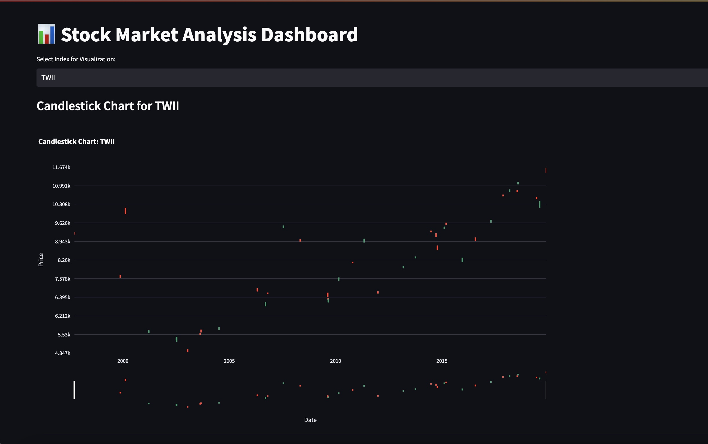

# 📈 Real-Time Stock Market Analysis Dashboard

## Overview
The **Real-Time Stock Market Analysis Dashboard** is an interactive tool designed to visualize, analyze, and explore real-time stock market trends. This project leverages cutting-edge technologies such as **Python**, **AWS Glue**, **Athena**, **Apache Kafka**, and **SQL** to build an end-to-end pipeline for processing and visualizing stock market data. **AWS S3** and **EC2** services, along with the **boto3 SDK**, are integrated for seamless cloud data storage, computation, and processing.

---

## Demo 🎥

Click the GIF above to watch the demo of the App on YouTube or here's the link (https://www.youtube.com/watch?v=szyyI5sOzg4)

---

## Architecture

---

## Features
- **Real-Time Data Integration**: Streams data using **Apache Kafka** and processes it in real time.
- **Data Transformation**: Structured and cataloged using **AWS Glue**.
- **Efficient Querying**: Fetches data from **AWS Athena** using **SQL** for analysis.
- **Interactive Visualizations**:
  - **Candlestick Charts**: Display stock price movements (open, high, low, close).
  - **Moving Average Charts**: Identify trends with dynamic moving averages.
  - **Correlation Heatmaps**: Visualize relationships between stock metrics.
  - **Comparison Charts**: Benchmark multiple indices over time.
- **Cloud Integration**:
  - **AWS S3**: Stores raw and processed stock market data for querying and visualization.
  - **AWS EC2**: Hosts the Kafka producer and consumer for real-time data streaming.
  - **boto3 SDK**: Interacts programmatically with AWS services like S3, Glue, and Athena.
- **Dynamic Dashboards**: Built with **Streamlit** for responsive, user-friendly interfaces.

---

## Technology Stack
### 1. **Python**
   - Core programming language for processing data and creating visualizations.
   - Libraries Used: `pandas`, `plotly`, `seaborn`, `matplotlib`, `streamlit`.

### 2. **Apache Kafka**
   - Simulates real-time stock market data streams.
   - Kafka **producers** publish real-time stock data to topics.
   - Kafka **consumers** retrieve data for processing and analysis.

### 3. **AWS Glue**
   - Transforms raw data into a structured format.
   - Catalogs data for querying in AWS Athena.

### 4. **AWS Athena**
   - Runs SQL queries on structured data stored in **AWS S3**.
   - Provides quick access to both real-time and historical data.

### 5. **AWS S3**
   - Serves as the central storage for raw and processed data.
   - Enables efficient querying via AWS Athena.

### 6. **AWS EC2**
   - Hosts Kafka producer and consumer services.
   - Ensures seamless execution of the data streaming pipeline.

### 7. **boto3 SDK**
   - Python SDK for programmatically interacting with AWS services.
   - Used for tasks like uploading data to S3, running Glue jobs, and querying Athena.

### 8. **SQL**
   - Query language for fetching and analyzing stock market data.

### 9. **Streamlit**
   - Framework for creating an intuitive, interactive dashboard.
